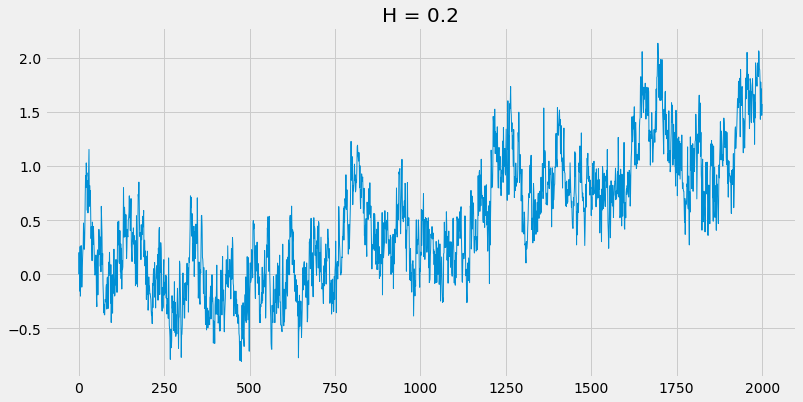
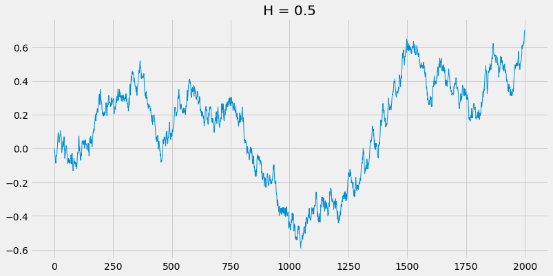
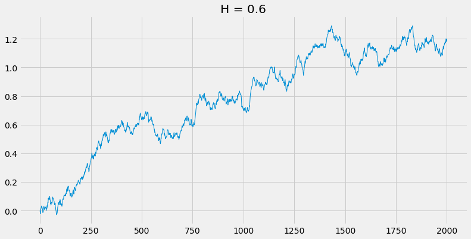
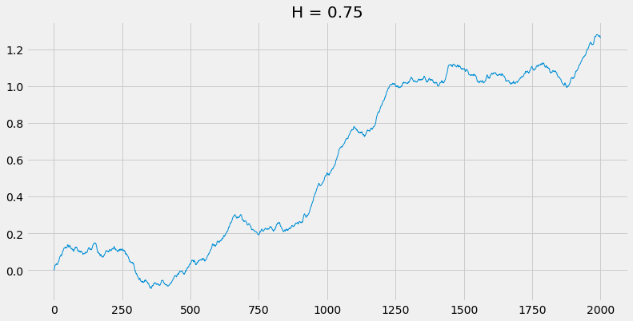

# Fractional-Brownian-Motion
Python implementation of Fractional Brownian Motion (FBM) simulation using Hosking, Cholesky, and Davies-Harte methods for generating samples of fractional Gaussian noise. FBM is obtained by taking cumulative sums of the sample of FGN.

## Hosking's method:
This method computes samples of fractional Gaussian noise (FGN) using knowledge of the conditional distribution of FGN. The complexity of this algorithm is of order O(N^2)

## Cholesky's method:
This method makes use of the Cholesky decomposition of the covariance matrix to generate samples of FGN. For each row of the Choleksy matrix that this algorithm generates, a single sample of FGN is obtained. This means that the complexity for this algorithm is of order O(N^3). However, the Cholesky matrix can be saved in memory after the first simulation, meaning that each subsequent simulation is of order O(N^2).

## Davies-Harte method:
This method obtains samples of FGN by embedding the covariance matrix in a "circulant covariance matrix" of size 2N. This allows for efficient computation of the "square root" of the covariance matrix. The eigenvalues of this matrix are used to generate samples of FGN. This algorithm makes use of the Fast Fourier Transform (FFT) for efficiency. The complexity of this algorithm is of order O(N log(N)).

## Plotting sample paths
Sample paths with different Hurst parameters
 

## Required packages:
numpy

